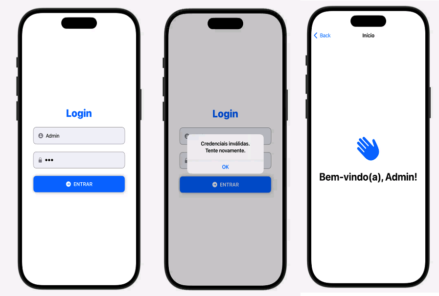

# Pós-Graduação em Desenvolvimento Mobile e Cloud Computing – Inatel
## DM126 - Desenvolvimento de aplicativos em Swift para iOS

## Exercícios Aula 2

### 👤 Autor: 
José Enderson Ferreira Rodrigues   
jose.rodrigues@pg.inatel.br, jose.e.f.rodrigues.br@gmail.com

## 📌 Implementação
Aplicativo iOS com SwiftUI desenvolvido no X-Code

### Requisitos atendidos:
✅ Desenvolvimento de tela de autenticação personalizada. Utilizando ícones, botões com imagens. Exploração das proriedades dos componentes para criar fluência dentro da SwiftUI.

✅ Execução de uma nova “View” a partir do sucesso do login.

## 📌 Imagens do projeto 
   

## 🛠️ IDE
- **X-Code**

## 💻 Linguagem
- **Swift**
